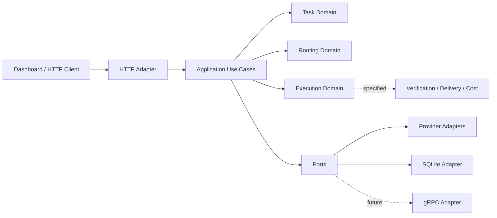

# luyou - AI Model Router

`luyou` 是一个基于 Python 3.12、DDD、TDD 与 Ports & Adapters 构建的 AI 模型路由和任务执行平台 Demo。系统分析任务类型、复杂度、能力、预算与 Provider 状态，生成可解释的候选模型决策，并通过有限重试、顺序 Fallback、Trace 和确定性测试保障基础可靠性。

当前版本已经具备模型路由、Provider 执行、持久化任务 CRUD、DeepSeek Goal-first 任务分析、确定性 Markdown 清单、可靠性模拟和六页管理工作台；ExecutionJob、多 Agent DAG、自动验证、受限修复与成本台账已完成规格设计，但尚未实现完整运行时闭环。

## 当前能力

### 已实现

- 基于任务类型、复杂度和预算压力的确定性路由。
- LiteLLM Provider Port/Adapter、模型目录与健康过滤。
- 同模型有限重试、候选模型顺序 Fallback、不可重试错误快速失败。
- OpenAI 兼容的 `/v1/chat/completions` HTTP API。
- Bearer 鉴权、CORS allowlist、工作目录限制和内存限流。
- Trace ID、Attempt 事件、请求指标和可靠性故障模拟。
- `ExecutionTask` 聚合、SQLite 持久化、乐观锁和原子删除。
- DeepSeek 自动技术栈、任务类型、复杂度、优先级及理由、标签、通过率、子任务和模型建议分析。
- 新分析只会进入 `draft` 或 `ready`，并统一归为“未完成”；完成状态必须由后续执行与验收证据驱动。
- 后端确定性 Markdown 清单、SHA-256 内容哈希、确认后创建与失败补偿。
- 六页原生 HTML/CSS/JavaScript 工作台。
- Dockerfile、Compose、可复用 Skills 与边界 Agents。

### 已完成规格，待实现

- 持久化 `ExecutionJob` 状态机、幂等创建、Worker Lease 与恢复。
- 项目上下文快照、DAG Plan 和多 Agent 并行准入。
- 24 段确定性 `PromptPackage`、规范化 JSON 与 SHA-256 哈希。
- `ENFORCED`、`VERIFIED_FALLBACK`、`EXECUTOR_MANAGED` 模型绑定证据。
- ExecutionReceipt、ArtifactStore、VerificationReport 和受限 Repair。
- Token、模型、Attempt、预算预留和实际成本台账。

### 明确未实现

- 运行中的 gRPC Client/Server。`proto/model_router.proto` 目前仅定义未来服务边界。
- 分布式队列、多实例状态、Kubernetes、流式响应和完整 Circuit Breaker。
- OpenSpec CLI 或代码生成工具。本仓库采用 OpenSpec 风格的规格目录和契约测试。
- 可宣称生产就绪的全自动多 Agent 任务完成平台。

## 架构



依赖方向保持为 `adapters -> application -> domain`。领域层不依赖 HTTP、SQLite、LiteLLM、Dashboard 或未来 gRPC 传输实现。

### DDD 限界上下文

| 上下文 | 当前职责 | 状态 |
|---|---|---|
| Task | 用户目标、任务字段、生命周期与 CRUD | 已实现 |
| Routing | 分类、候选模型、预算和路由决策 | 已实现 |
| Provider | 模型调用、错误归一化、健康与 Usage | 已实现 |
| Execution | Retry/Fallback；未来 Job、Attempt、Receipt | 部分实现 |
| Planning | Goal 分析、技术栈、验收标准、分解、模型建议与 Markdown | 第一阶段已实现 |
| Verification | 验收命令、证据和成功判定 | 已规格化 |
| Delivery | Artifact 与最终报告 | 已规格化 |
| Cost | 预算预留、Token 和实际成本 | 已规格化 |

执行闭环规格入口见 [`specs/execution-closure/overview.md`](specs/execution-closure/overview.md)，架构决策见 [`docs/adr/`](docs/adr/)。

## 技术栈

- Runtime: Python 3.12
- Provider abstraction: LiteLLM
- Configuration: YAML、环境变量
- Persistence: SQLite
- Frontend: 原生 HTML、CSS、JavaScript
- Architecture: DDD、模块化单体、Ports & Adapters
- Quality: unittest、Contract Test、Integration Test、TDD、阶段二次审计
- Delivery: Docker、Docker Compose
- Future boundary: Protocol Buffers、gRPC

## 快速开始

### 1. 安装

```powershell
cd C:\Codex\luyou
python -m pip install -e .
```

### 2. 配置

Provider 配置参考 [`config/relay.env.example`](config/relay.env.example) 和 [`config/relay_models.yaml`](config/relay_models.yaml)。运行时配置参考 [`config/runtime.env.example`](config/runtime.env.example)。不要提交真实密钥；已在聊天、日志或提交中暴露的密钥必须轮换。

常用环境变量：

```powershell
$env:MODEL_ROUTER_API_TOKEN = "" # 本机回环地址默认关闭 Bearer 锁
$env:MODEL_ROUTER_PORT = "1785"
$env:MODEL_ROUTER_ALLOWED_ORIGINS = "http://127.0.0.1:1785,http://localhost:1785"
$env:MODEL_ROUTER_ALLOWED_WORKDIRS = "C:\Codex"
$env:MODEL_ROUTER_RATE_LIMIT_PER_MINUTE = "120"
$env:MODEL_ROUTER_DB_PATH = "C:\Codex\luyou\.runtime\model-router.db"
$env:DEEPSEEK_API_KEY = "set-in-process-environment-only"
```

### 3. 启动

```powershell
python scripts/dashboard_server.py
```

打开 [http://127.0.0.1:1785](http://127.0.0.1:1785)，并验证：

```powershell
curl.exe http://127.0.0.1:1785/health
```

## 六页 Demo

| 页面 | 地址 | 能力 |
|---|---|---|
| 系统总览 | `/` | Git、目录、请求指标与最近事件 |
| 路由实验室 | `/routing.html` | 路由结果、子任务、Trace 与 Provider 尝试链 |
| Provider 目录 | `/providers.html` | 运行时模型目录与 Provider 健康状态 |
| 可靠性实验室 | `/reliability.html` | Timeout、Retry、Fallback 与 Fail-fast 模拟 |
| 架构与规格 | `/architecture.html` | DDD 边界、ADR、质量门禁与延期项 |
| 任务工作台 | `/tasks.html` | Goal-first DeepSeek 分析、清单确认、SQLite Task CRUD 与鉴权恢复 |

## HTTP API

### 公共端点

| Method | Path | 说明 |
|---|---|---|
| GET | `/health` | 服务健康状态 |

### 路由与执行端点

| Method | Path | 说明 |
|---|---|---|
| POST | `/v1/chat/completions` | OpenAI 兼容入口 |
| POST | `/api/route` | 路由和现有 Dispatcher 执行入口 |
| POST | `/api/reliability/simulate` | 可控故障模拟 |
| GET | `/api/catalog` | Provider、模型与路由目录 |
| GET | `/api/metrics` | 内存指标与事件 |
| GET | `/api/meta` | 运行时元数据 |
| GET | `/api/specs` | 当前架构摘要，尚未暴露全部规格文件 |
| GET | `/api/cursor/queue` | Cursor 待处理队列摘要 |

### Task API

| Method | Path | 说明 |
|---|---|---|
| GET | `/api/tasks` | 列表、搜索与筛选 |
| POST | `/api/tasks` | 创建 Task |
| POST | `/api/tasks/analyze` | DeepSeek 分析 Goal 与可选 Scope；不创建 Task |
| POST | `/api/tasks/from-analysis` | 校验分析并创建 Task 与 Markdown 清单 |
| GET | `/api/tasks/<task_id>` | Task 详情 |
| GET | `/api/tasks/<task_id>/plan.md` | 读取后端生成的 UTF-8 Markdown 清单 |
| PUT | `/api/tasks/<task_id>` | 更新并校验版本和状态跃迁 |
| DELETE | `/api/tasks/<task_id>` | 原子删除；运行中或验证中返回 409 |

`MODEL_ROUTER_API_TOKEN` 是 Dashboard API 的可选 Bearer 访问令牌，不是模型 Provider 密钥。本机 `127.0.0.1` Demo 可保持空值以关闭此锁；共享主机或非回环监听必须配置独立的高强度随机令牌。配置后，除 `/health` 和静态页面外的 API 需要：

```text
Authorization: Bearer <token>
```

## 路由与可靠性策略

1. 任务分类器生成任务类型和复杂度。
2. 路由策略根据能力、成本和质量目标生成候选链。
3. Registry 过滤不可用 Provider。
4. ExecutionService 对可重试错误执行有限重试。
5. 主候选失败后按顺序 Fallback。
6. Authentication、Invalid Request 等错误直接 Fail-fast。
7. Trace ID 贯穿候选选择与每次 Attempt。

路由结果不等于任务已完成；模型回答不等于结果正确；Cursor `queued` 只表示已入队。

## TDD 与质量门禁

每个阶段遵循：

```text
Specification -> DDD Boundary -> Contract -> Red Tests
-> Red-only Commit/Push -> Minimal Implementation -> Green
-> Full Regression -> Secondary Assessment -> Commit/Push
```

当前确定性基线：

- `python -m unittest discover -s tests -v`：82/82 通过（2026-07-28）
- `python scripts/test_dashboard_demo.py`：10/10 通过（2026-07-28）
- `node --check dashboard/assets/app.js`：通过
- `git diff --check`：通过

运行完整门禁：

```powershell
python -m unittest discover -s tests -v
python scripts/test_dashboard_demo.py
node --check dashboard/assets/app.js
git diff --check
python skills/model-router-delivery/scripts/assess_phase.py --phase local-check
```

在线评估与确定性测试分开记录。2026-07-23 的 `run_acceptance.py` 为 6/7；其中 L2 分类为 20/25。该结果不能替代离线 Contract 和 Integration Tests。

## 目录结构

```text
src/model_router/
  domain/          聚合、值对象、不变量和领域错误
  application/     应用用例与跨端口编排
  ports/           Provider、Repository 等抽象契约
  adapters/        HTTP、SQLite、Provider 等基础设施实现
specs/             可执行规格与执行闭环 OpenSpec 风格文档
docs/adr/          架构决策记录
docs/assessment/   每阶段二次审计证据
dashboard/         六页原生 Web UI
scripts/           服务入口、验收与质量脚本
skills/            可复用交付、Provider 和可靠性审计能力
tests/             unit、contract、integration 测试
proto/             未来 gRPC 服务边界
```

根级工程约束见 [`AGENTS.md`](AGENTS.md)，完整状态见 [`STATUS.md`](STATUS.md)，完成矩阵见 [`docs/checklist-matrix.md`](docs/checklist-matrix.md)。

## Docker

```powershell
docker compose up --build
```

当前主机未记录 Docker Engine 实跑证据，因此仓库只宣称已提供 Docker/Compose 定义。详细安全和部署说明见 [`docs/deployment.md`](docs/deployment.md)。

## 下一阶段

下一阶段是把已确认的父 Task 与分析中的子任务转换为持久化 `ExecutionJob` / DAG，并编译执行级 PromptPackage；之后才接入受约束模型执行、VerificationReport 与成本结算。

## 真实性边界

- gRPC 已设计边界，但没有运行时服务。
- OpenSpec 风格规格已落地，但未采用 OpenSpec CLI。
- Codex 当前无法证明强制使用推荐模型，只能标记为 `EXECUTOR_MANAGED`。
- DeepSeek 分析与 Task 创建不等于子任务已持久化、模型已调用或交付物已验证。
- DeepSeek 可以建议优先级并解释依据，但不能仅凭用户描述把新任务标记为已完成。
- Provider 返回文本不代表仓库修改或验收通过。
- `routed`、`queued`、`answered`、`executed`、`verified`、`delivered` 是不同状态。
- 只有 VerificationReport 为 PASS，未来 ExecutionJob 才能进入 SUCCEEDED。
