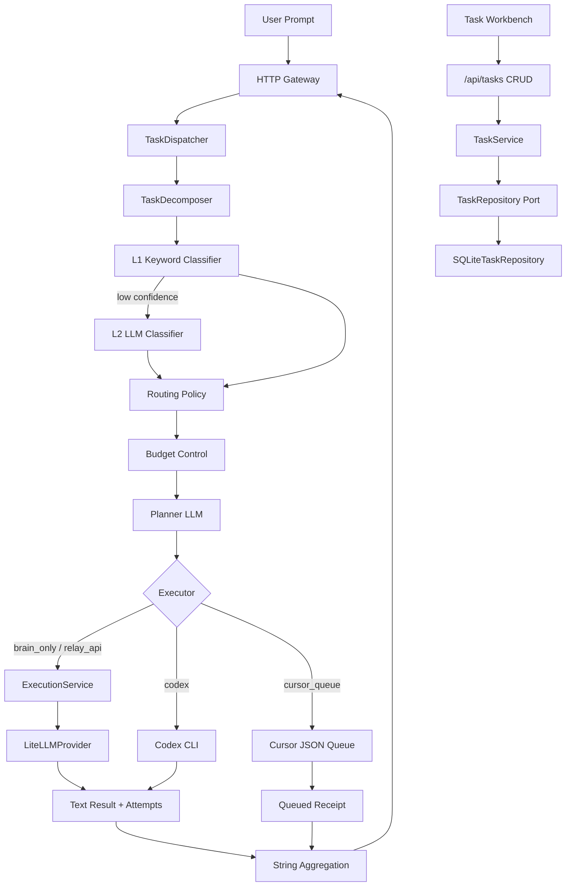
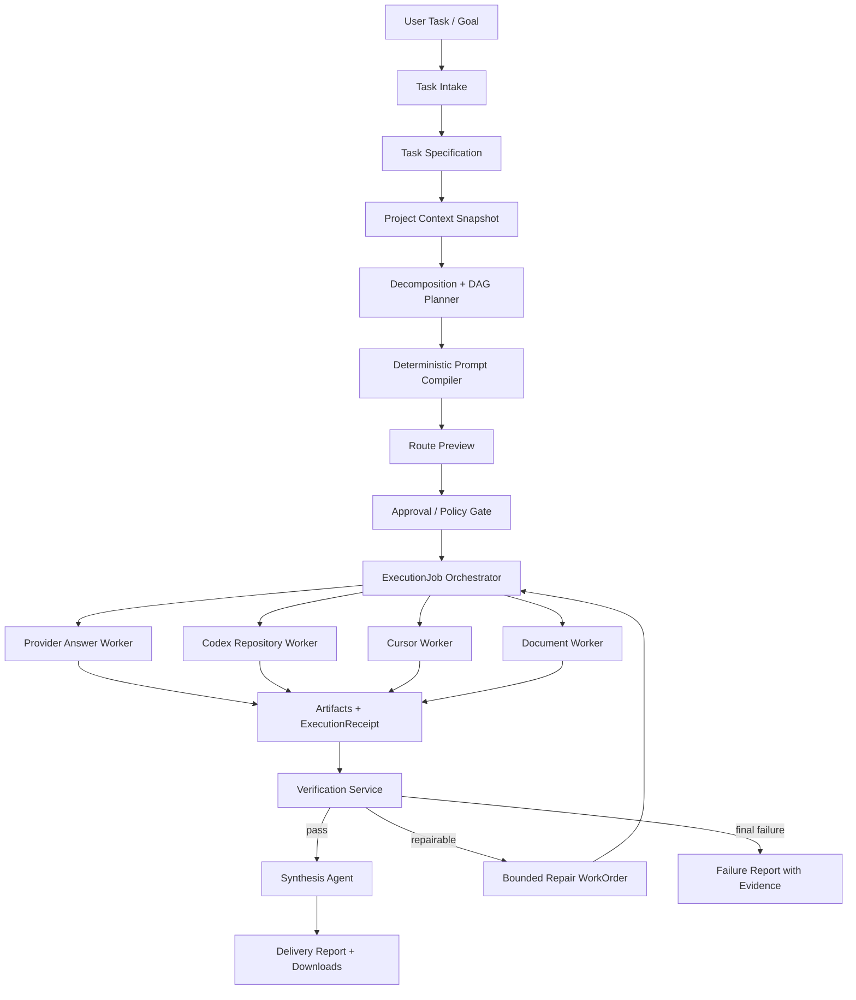

# AI Model Router 当前仓库状态审计与一体化任务路由实施路线图

> 审计日期：2026-07-26  
> 文档用途：直接交给 Claude 或其他工程 Agent，作为继续实现的一致事实源、边界说明和执行清单  
> 仓库绝对路径：`C:\Codex\luyou`  
> GitHub：`https://github.com/Glock-Ckly/luyou.git`  
> 当前分支：`main`  
> 审计采样 HEAD：`2e8d962`  
> 审计采样 origin/main：`1183926`  
> 本地服务：`http://127.0.0.1:1785`  
> 任务工作台：`http://127.0.0.1:1785/tasks.html`

---

## 0. 给 Claude 的先读结论

这个仓库已经不是一个空项目，也不是只有静态页面的原型。

当前真实具备：

1. 用户 Prompt 的启发式拆分和 LLM 拆分。
2. L1 关键词分类与 L2 LLM 分类。
3. 12 类任务类型、T0-T4 复杂度、29 条路由规则。
4. 14 个模型目录项、4 类 Provider/执行入口。
5. 基于预算压力的模型降级、能力下限和 fallback 链。
6. Provider 路径的真实 LiteLLM 调用、实际模型响应、有限重试和 fallback。
7. Codex CLI 非交互执行入口。
8. Cursor 本地任务队列。
9. Trace、Attempt、内存指标、鉴权、CORS、工作目录限制和限流。
10. SQLite 持久化的 ExecutionTask CRUD。
11. 六个前端页面，其中任务工作台采用类淘宝的嵌套式信息架构。
12. 40 项离线测试、8 项 Dashboard 检查、3 个可复用 Skill 和 4 个边界 Agent。

当前不具备：

1. 持久化 ExecutionJob 状态机。
2. 项目上下文快照和敏感信息过滤。
3. 确定性 PromptPackage Markdown/JSON 编译与哈希。
4. Codex 路径的可证明模型绑定。
5. Cursor Worker 的 lease、heartbeat、结果回写和恢复。
6. 执行 Artifact、changed files、测试证据的统一持久化。
7. 自动 Verification 和受限 Repair 循环。
8. 多子任务 DAG、并行调度、依赖管理和最终结果综合。
9. 真实成本台账、配额持久化和质量/成本自适应策略。
10. 清单要求的一体化 Task -> Specification -> Plan -> Prompt -> Route -> Execute -> Validate -> Repair -> Deliver 闭环。

因此，后续工作必须建立在现有路由和执行核心之上，不应重写一套平行系统，也不得把“已路由”“已入队”“已返回文本”描述成“仓库任务已完成”。

---

## 1. 审计方法和工程流程

本仓库已经定义并要求继续遵循以下流程：

```text
Specification
  -> DDD Boundary
  -> Contract
  -> TDD Red
  -> Minimal Implementation
  -> Green / Refactor
  -> Full Regression
  -> Secondary Assessment
  -> Commit
  -> Immediate Push
```

每个阶段必须满足：

- 一个阶段只解决一个可验证问题。
- 行为变化前先修改规格或 ADR。
- 先增加失败测试并记录 Red，再写最小实现。
- 不降低断言、不跳过测试、不吞异常来获得 Green。
- 运行聚焦测试、完整离线测试、Dashboard 检查和 `git diff --check`。
- 在 `docs/assessment/` 新增二次评估。
- 每个逻辑阶段独立 Commit 并立即 Push。
- 在线模型评估必须与确定性测试分开报告。
- queued 不等于 completed，route 不等于 executed，recommended model 不等于 enforced binding。

可复用流程资产：

- `skills/model-router-delivery`
- `skills/provider-adapter-contract`
- `skills/router-reliability-audit`
- `skills/agents/architecture-ddd-agent.md`
- `skills/agents/provider-adapter-agent.md`
- `skills/agents/tdd-implementation-agent.md`
- `skills/agents/release-audit-agent.md`

---

## 2. 仓库和运行环境状态

### 2.1 基础信息

| 项目 | 当前值 |
|---|---|
| 仓库 | `C:\Codex\luyou` |
| 远端 | `https://github.com/Glock-Ckly/luyou.git` |
| 主分支 | `main` |
| Python | `>=3.12` |
| 主要依赖 | `litellm>=1.70,<2`、`PyYAML>=6,<7` |
| 架构 | Python 模块化单体、Ports & Adapters |
| HTTP 服务 | 标准库 `ThreadingHTTPServer` |
| 本地端口 | `1785` |
| 任务数据库 | SQLite，默认 `.runtime/model-router.db` |
| 部署定义 | Dockerfile + Compose |
| Docker 实跑证据 | 当前没有 |
| gRPC | 只有 `proto/model_router.proto`，没有运行时实现 |

### 2.2 Git 状态

审计采样时：

- 本地 HEAD：`2e8d962 feat: add nested execution task workbench`
- 远端 HEAD：`1183926 feat: add persistent execution task CRUD`
- 本地 `main` 比 `origin/main` 领先 1 个提交。
- UI 工作台提交尚未出现在 GitHub 远端。
- 这是发布流程的未完成项，后续任何实现前应先恢复网络并推送。

### 2.3 本地运行状态

- `127.0.0.1:1785` 正在监听。
- 审计时进程 PID：`14704`。
- `/health` 返回正常。
- `/api/meta` 返回仓库路径、Git 版本、预算和目录统计。
- 审计时数据库中有 1 条 `running` 任务；本文不复制其完整用户输入。

---

## 3. 当前系统真实架构



关键判断：当前存在两条尚未统一的业务线。

1. `TaskDispatcher` 负责即时拆分、分类、路由和执行。
2. `ExecutionTask` 负责持久化任务目录 CRUD。

任务目录中的任务不会自动进入 Dispatcher；Dispatcher 的结果也不会自动回写 ExecutionTask。下一阶段必须用持久化 ExecutionJob 将两条业务线连接起来。

---

## 4. 当前已经实现的能力

### 4.1 Task 拆分

文件：`src/task_decomposer.py`

已实现：

- 长 Prompt、编号步骤、多任务连接词触发拆分考虑。
- 使用 `deepseek/deepseek-v4-flash` 生成 2-5 个自包含子任务。
- 子任务带 `type_hint`。
- LLM 或解析失败时回退为单任务。
- 对 force 模式有一次纠正重试。

限制：

- 子任务只是内存 dataclass，没有 ID、依赖、版本或持久化。
- 没有 DAG，所有子任务按顺序执行。
- 没有共享上下文、输入 Artifact 或输出 Artifact 契约。
- 没有拆分质量评分、重复子任务检测、冲突检测或最大子任务成本。

### 4.2 Task 分类

文件：`src/l1_classifier.py`、`src/l2_classifier.py`

已实现：

- L1 关键词快筛。
- L1 低置信时调用 L2 LLM 分类。
- L2 输出 `task_type`、`complexity`、`confidence` 和 `reasoning`。
- L2 失败时返回 `uncertain`，不会直接抛出原始异常。

当前 12 类 TaskType：

1. architecture
2. system_design
3. deep_reasoning
4. implementation
5. debugging
6. refactor
7. boilerplate
8. bulk_generation
9. data_processing
10. code_patch
11. file_edit
12. uncertain

当前复杂度：

- T0 trivial
- T1 simple
- T2 moderate
- T3 complex
- T4 deep_reasoning

已知质量数据：

- 历史在线 L2 评估为 20/25，80%，不是满分。
- 失败样本集中在 implementation/debugging 等被误判为 uncertain。
- 该在线结果未在 2026-07-26 重跑，不能作为当前确定性发布门禁。

### 4.3 Routing 和成本策略

文件：`src/routing_table.py`

当前数据：

- 12 个任务策略。
- 29 个 TaskType + Complexity 路由项。
- 14 个模型目录项。
- Provider 分类：OpenAI、Anthropic、DeepSeek、Local Cursor Queue。
- 每个路由项具有 primary 和 ordered fallback。
- 每类任务具有 executor、模型能力 floor 和 cost level。

预算区间：

| Budget Ratio | Zone | 当前行为 |
|---:|---|---|
| `< 0.60` | green | 不干预 |
| `>= 0.60` | yellow | 非关键任务沿 fallback 降一级 |
| `>= 0.75` | orange | 选择不低于能力下限的最便宜候选 |
| `>= 0.90` | red | 非关键任务优先 flash，仍尊重 floor |

关键任务：architecture、system_design、deep_reasoning。

审计时 `/api/meta` 返回 `budget_ratio=0.5`。该值来自外部 Budget Oracle；不可用时适配器会静默返回 `0.0`。当前没有持久化 spend/cap 台账，因此预算控制仍是部分能力。

### 4.4 Planner 和 Prompt

文件：`src/prompts/planner.txt`、`src/dispatcher.py`

Planner 当前输出：

- summary
- direction
- codex_prompt
- executor
- priority

当前优点：

- Planner 与分类、路由分开。
- Planner 失败时保留安全回退，任务仍可执行。
- Executor 类型受到 TaskType 规则约束，不完全信任 Planner。

关键缺口：

- Planner 不读取 AGENTS、Git、规格、ADR、代码符号、测试或文件边界。
- Prompt 不是强类型 PromptPackage。
- 没有模板版本、内容哈希、敏感信息扫描或 Artifact。
- Planner 可以提供建议，但当前后端没有不可覆盖的 FileScope、CommandPolicy 和 Acceptance Criteria。
- 生成的 Prompt 无法稳定重建，也没有独立 Markdown 下载入口。

### 4.5 Provider 执行

文件：`src/model_router/application/execution_service.py`、`src/model_router/adapters/providers/litellm_provider.py`

已实现：

- 标准 ModelRequest/ModelResponse。
- Provider Registry。
- Provider health 过滤。
- 同模型有限重试。
- 按候选顺序 fallback。
- Authentication/Invalid Request 等不可重试错误 fail-fast。
- 单一 Trace ID 贯穿 Attempt。
- 响应保存实际返回模型 ID、Usage 和 cost 字段。

真实边界：

- Provider 执行可以生成文本答案。
- Provider 执行不能自动修改仓库、运行命令、验证文件或提交 Git。
- Health 当前主要是“适配器已配置”的被动状态，不是主动探测。
- Usage/cost 没有从 Dispatcher 汇总到持久化账本。

### 4.6 Codex 执行

文件：`src/codex_executor.py`、`src/dispatcher.py`

已实现：

- 调用 `codex exec`。
- 支持 workdir、timeout、stdout/stderr、exit code 和最终消息文件。
- CLI 不存在或超时时返回标准失败对象。

真实边界：

- 路由模型只以 `Preferred execution model from router: ...` 写入 Prompt。
- `codex exec` argv 中没有被测试证明的模型参数。
- 因此当前绑定状态只能是 `EXECUTOR_MANAGED`，不能宣称 `ENFORCED`。
- 当前没有 changed files、实际模型、命令证据、文件范围和测试结果的标准 ExecutionReceipt。

### 4.7 Cursor Queue

文件：`src/cursor_queue.py`

已实现：

- 将 code_patch/file_edit 任务写入 `~/.llm-router/cursor_queue.json`。
- 支持 push、pop、mark_done、list 和 stats。

真实边界：

- Cursor 没有自动执行 API。
- queued 只表示已入队。
- pop 后需要人工处理。
- 没有租约、heartbeat、worker identity、幂等或结果 Artifact。
- 当前 Dispatcher 把入队结果的 `success` 设为 true，这只表示交付到队列成功，不表示任务完成。

### 4.8 Task CRUD

文件：

- `src/model_router/domain/execution_task.py`
- `src/model_router/application/task_service.py`
- `src/model_router/ports/task_repository.py`
- `src/model_router/adapters/persistence/sqlite_task_repository.py`

已实现字段：

- task_id
- title
- description
- task_type
- status
- priority
- technology_stack
- scope
- acceptance_criteria
- tags
- version
- created_at / updated_at

已实现 API：

- `GET /api/tasks`
- `POST /api/tasks`
- `GET /api/tasks/<task_id>`
- `PUT /api/tasks/<task_id>`
- `DELETE /api/tasks/<task_id>`

已实现规则：

- 标题、描述和枚举值校验。
- 集合去空和去重。
- 更新增加 version。
- running/validating 不允许删除。
- SQLite 持久化和乐观更新。
- 400/404/409 领域错误映射。

已确认缺陷：

1. `version="abc"` 会产生 500，而不是 400 invalid_task。
2. `tags="ab"` 会被保存成 `["a", "b"]`，集合字段缺少类型校验。
3. 删除保护和 SQL DELETE 不是原子操作，存在状态竞争窗口。
4. 允许任意状态直接跳转，没有领域状态机。
5. Task CRUD 没有自动连接 Dispatcher 或 ExecutionJob。

### 4.9 HTTP Gateway 和可观测性

已实现：

- `/health`
- `/v1/chat/completions`
- `/api/meta`
- `/api/catalog`
- `/api/specs`
- `/api/metrics`
- `/api/route`
- `/api/reliability/simulate`
- `/api/cursor/queue`
- `/api/tasks...`
- Bearer Token
- CORS allowlist
- Workdir allowlist
- 每分钟内存限流
- 安全错误响应
- Trace、Attempt 和内存指标

限制：

- HTTP 请求内同步执行长任务，没有异步 Job。
- 限流和指标重启后丢失，多实例不共享。
- 不支持流式响应、取消、恢复和 Job 查询。
- 根 README 尚未列出 Task CRUD 和第六页工作台。

---

## 5. 当前前端页面审计

当前共有 6 个页面，不再是 README 所写的 5 页。

| 页面 | 路径 | 当前真实能力 |
|---|---|---|
| 系统总览 | `/` | Git、目录、请求指标和最近事件 |
| 路由实验室 | `/routing.html` | 输入 Prompt，查看拆分、分类、路由、Trace、子任务和执行结果 |
| Provider 目录 | `/providers.html` | Provider health、模型、成本目录和路由引用 |
| 可靠性实验室 | `/reliability.html` | 故障注入、Retry/Fallback、Attempt 和最终结果 |
| 架构与规格 | `/architecture.html` | DDD 边界、质量门禁和延期项 |
| 任务工作台 | `/tasks.html` | SQLite Task CRUD、搜索、筛选、详情和执行流水线边界视图 |

任务工作台当前采用类淘宝但不复制品牌资产的信息架构：

- 顶部品牌区、全局搜索和新建任务。
- 左侧分类和状态导航。
- 中间任务目录和筛选器。
- 右侧统计、流程和详情。
- 创建/编辑 Dialog。
- 桌面三栏、平板两栏、移动单栏。

前端缺口：

- Task 页面没有“分析并执行”按钮和 ExecutionJob 详情。
- Routing 页面没有区分 Route Preview 与 Execute Job。
- 没有 PromptPackage Markdown 预览和下载。
- 没有模型绑定状态、真实模型、成本和 token 账单。
- 没有 DAG、多 Agent 节点、依赖和并行状态。
- 没有 Artifact、changed files、验证证据和 Repair 时间线。
- 异步刷新/筛选/删除的 Promise 没有统一错误处理。
- Dashboard 测试以 DOM marker 为主，不是完整自动化浏览器 E2E。

---

## 6. 测试、审计和质量状态

### 6.1 2026-07-26 确定性验证

| 检查 | 结果 |
|---|---|
| `python -m unittest discover -s tests -v` | 40/40 通过 |
| `python scripts/test_dashboard_demo.py` | 8/8 通过 |
| `node --check dashboard/assets/app.js` | 通过 |
| `git diff --check` | 通过 |
| `skills/model-router-delivery/scripts/assess_phase.py` | 通过 |
| Provider Adapter Boundary | 通过 |
| Router Reliability Audit | 通过 |

LiteLLM 获取远程模型价格表失败时使用本地备份；这是警告，不影响确定性测试，但说明外部网络依赖需要缓存和版本控制。

### 6.2 TDD 完成度

优点：

- Domain、Provider、ExecutionService、HTTP、SQLite CRUD 都有测试。
- Retry/Fallback、不可重试错误、Trace 和 health filtering 有生产路径测试。
- Task CRUD 有 unit、repository integration 和 real HTTP integration。

缺口：

- Red 测试和实现经常位于同一个 Git 提交，历史无法严格证明先 Red 后 Green。
- 没有 ExecutionJob、PromptPackage、ModelBinding、Artifact、Verification 和 Repair 测试，因为这些领域尚未实现。
- 没有任务状态转换矩阵测试。
- 没有非法集合类型、非法 version 和并发删除测试。
- 没有真实浏览器自动化持续测试。
- 没有 Docker 重启恢复、负载、并发和灾难恢复测试。

---

## 7. 对最终目标的完成度判断

最终目标：

> 构建一个一体化、多界面、类淘宝信息架构的任务路由与完成系统。系统分析用户 task/goal，将提示词从多个角度拆解，按照任务类型、难度、模型能力、质量要求、成本和可用性分配给多个模型或 Agent，并对结果进行聚合、验证、修复和交付。

按能力判断：

| 目标能力 | 状态 | 说明 |
|---|---|---|
| Prompt 输入 | 已完成 | Routing 页面和 OpenAI 兼容 API |
| Task CRUD | 已完成第一版 | SQLite 持久化，但未接执行 |
| 多角度拆分 | 部分完成 | 有 Decomposer，无 DAG 和持久化 |
| 类型/难度分析 | 已完成基础版 | L1/L2 + T0-T4 |
| 多模型路由 | 已完成基础版 | 29 路由项和 fallback |
| 成本约束 | 部分完成 | 静态成本和预算压力，无真实账本 |
| Provider 真实执行 | 已完成 | 文本任务可执行 |
| Codex 仓库执行 | 部分完成 | 能调用 CLI，模型绑定和证据不足 |
| Cursor 执行 | 未完成 | 仅队列交付 |
| 多 Agent 并行协作 | 未完成 | 当前子任务串行 |
| 上下文自动收集 | 未完成 | 无 ProjectContextSnapshot |
| 完整 Prompt 自动编译 | 未完成 | 无 PromptPackage |
| Job 状态机 | 未完成 | 无持久化 ExecutionJob |
| 自动验证 | 未完成 | response_validator 未接主执行闭环 |
| 自动修复 | 未完成 | 无受限 Repair 循环 |
| Artifact/报告 | 未完成 | 无统一 ArtifactStore 和最终报告 |
| 一体化 UI | 部分完成 | 六页已有，缺 Job/DAG/Artifact/成本中心 |
| 生产化运行 | 未完成 | 单进程、本地状态、无恢复和分布式能力 |

结论：当前是“可运行的模型路由 Demo + Task CRUD 工作台”，不是“可审计的多 Agent 任务完成平台”。

---

## 8. 目标一体化架构



设计原则：

1. Router 只选择执行者，不管理 Job 生命周期。
2. Orchestrator 只管理流程，不在执行中偷偷重分类。
3. Prompt Compiler 必须确定性生成安全边界；Planner 只能补充建议。
4. Executor 必须返回真实模型、实际行为和证据。
5. Verification 决定任务成功，不接受模型自我声明作为唯一证据。
6. Repair 有次数、成本、文件范围和时间上限。
7. 所有状态、Artifact 和证据可查询、可恢复、可审计。

---

## 9. 推荐 DDD Bounded Context

### 9.1 Task Intake Context

负责：

- 接收 goal、task、workdir、delivery_type、constraints。
- 生成 TaskId、JobId、TraceId、IdempotencyKey。
- 管理用户草稿、优先级和审批状态。

不负责：模型选择、Provider 调用、命令执行。

### 9.2 Project Context Context

负责：

- 读取适用 AGENTS。
- 收集 Git branch、HEAD、dirty state。
- 收集 specs、ADR、README、STATUS、相关代码、测试和依赖。
- 生成有大小上限和敏感信息过滤的 ProjectContextSnapshot。

不负责：路由、修改文件、执行测试。

### 9.3 Planning Context

负责：

- 将 Goal 转成 TaskSpecification。
- 生成 Subtask DAG、依赖、输入输出 Artifact 和验收标准。
- 标记可并行、必须串行、需要综合或需要评审的节点。

不负责：扩大安全边界、直接执行、最终判定成功。

### 9.4 Prompt Engineering Context

负责：

- 编译 PromptPackage JSON 和 Markdown。
- 固定模板版本和内容哈希。
- 合并 Goal、Context、DDD Boundary、FileScope、TDD、Acceptance Criteria、Return Schema。
- 移除密钥、无关环境变量和 forbidden content。

不负责：选择 Provider、执行命令、修改仓库。

### 9.5 Routing Context

负责：

- 依据 TaskType、Complexity、Capability、QualityTarget、CostBudget、Latency 和 Availability 生成 RouteDecision。
- 输出 primary、fallback、binding_mode 和降级条件。

不负责：Prompt 拼装、执行、验证。

### 9.6 Execution Context

负责：

- ExecutionJob Aggregate。
- WorkOrder、Attempt、lease、timeout、cancel、resume、retry。
- 调用 TaskExecutor Port。
- 保存 ExecutionReceipt 和 Artifact 引用。

不负责：重新分类或修改验收标准。

### 9.7 Verification Context

负责：

- 根据 delivery_type 选择测试、Lint、diff、Schema、敏感信息和内容质量策略。
- 生成 VerificationReport 和 Evidence。
- 判定 PASS、REPAIRABLE_FAILURE、FINAL_FAILURE。

### 9.8 Delivery Context

负责：

- 聚合子任务输出。
- 生成最终 Markdown 报告。
- 提供 Prompt、Artifact、Patch、日志摘要和验证证据下载。
- 在获得权限后 Commit/Push。

---

## 10. 推荐核心领域模型

### 10.1 Value Objects

- TaskId
- JobId
- TraceId
- IdempotencyKey
- SubtaskId
- ProjectSnapshotId
- PromptPackageId
- PromptTemplateVersion
- PromptContentHash
- ExecutorId
- ModelId
- ModelBinding
- FileScope
- CommandPolicy
- PermissionPolicy
- ExecutionBudget
- QualityTarget
- AcceptanceCriterion
- ArtifactId
- VerificationStatus

### 10.2 Aggregates

#### ExecutionTask

保留现有 CRUD 聚合，但增加合法状态转换和 `create_execution_job()` 领域行为。

#### TaskPlan

字段建议：

- plan_id
- task_id
- version
- subtasks
- dependency_edges
- synthesis_strategy
- risk_level
- estimated_cost
- approval_status

#### PromptPackage

字段建议：

- prompt_package_id
- task_id / subtask_id
- template_version
- content_hash
- system_prompt
- task_prompt
- project_context_snapshot_id
- file_scope
- command_policy
- acceptance_criteria
- output_schema
- redaction_report

#### ExecutionJob

字段建议：

- job_id
- task_id
- trace_id
- idempotency_key
- prompt_package_ids
- route_decisions
- state
- attempts
- artifacts
- verification_report
- budget
- version
- created_at / updated_at

状态建议：

```text
DRAFT
  -> ANALYZING
  -> WAITING_APPROVAL
  -> READY
  -> RUNNING
  -> VERIFYING
  -> REPAIRING
  -> SUCCEEDED
  -> FAILED
  -> CANCELLED
```

所有状态转换必须由 Aggregate 方法控制，禁止 HTTP 层直接赋值。

---

## 11. PromptPackage 必须自动生成的内容

每个可交给模型或 Agent 的 PromptPackage 至少包含：

1. Original Goal
2. Current Subtask
3. Why This Subtask Exists
4. Dependency Inputs
5. Project Context Summary
6. Applicable AGENTS Instructions
7. Relevant Specs and ADRs
8. DDD Bounded Context
9. Owned Invariants
10. Explicit Non-goals
11. Allowed Read Paths
12. Allowed Write Paths
13. Forbidden Paths
14. Allowed Commands
15. Forbidden Commands
16. Execution Budget
17. TDD Red/Green Workflow
18. Acceptance Criteria
19. Required Artifacts
20. Verification Commands
21. Return JSON Schema
22. Human-readable Report Format
23. Template Version
24. Content Hash

编译规则：

- 相同输入必须生成相同规范化 JSON、Markdown 和 Hash。
- 安全边界由后端确定，Planner 不得扩大。
- 缺少验收标准时先生成草案并进入审批，不能假设完成标准。
- 超出上下文预算时优先保留规格、边界、代码签名和测试。
- 不包含 API Key、Token、完整 `.env`、无关日志或用户隐私数据。

---

## 12. 多 Agent 协作设计

### 12.1 拆分角度

同一个 Goal 可按以下角度拆分：

- 需求和边界分析
- 架构与数据模型
- API/契约设计
- 前端交互与视觉实现
- 后端实现
- 测试和质量门禁
- 安全和权限审查
- 成本与性能评估
- 文档和交付

拆分不是简单复制 Prompt。每个子任务必须有独立输入、输出、依赖和验收标准。

### 12.2 Agent 角色

建议运行时角色：

| Agent | 主要职责 | 推荐模型层级 |
|---|---|---|
| Intent Analyst | 目标、约束、歧义和验收标准 | economy/workhorse |
| Architect | 边界、数据流、ADR 和风险 | brain |
| Planner | DAG、依赖、Artifact 和执行顺序 | workhorse/brain |
| Prompt Compiler | 确定性编译，不依赖自由模型决策 | 本地代码 |
| Repository Implementer | 修改仓库、运行测试 | repo-aware executor |
| Content/Data Worker | 纯文本、批量和数据转换 | flash/economy |
| Reviewer | 独立审查设计、Patch 和证据 | workhorse/brain |
| Verifier | 执行确定性门禁 | 本地代码 |
| Synthesis Agent | 合并多个输出并解决冲突 | workhorse/brain |
| Release Auditor | 最终 truthfulness、Git 和报告 | 独立 Agent |

### 12.3 并行规则

只有在以下条件全部满足时并行：

- 子任务无写路径冲突。
- 子任务不依赖另一个未完成 Artifact。
- 总预算允许。
- 并发 Provider 配额允许。
- 每个子任务有独立幂等键。

必须串行的情况：

- 设计先于实现。
- Schema 先于 API/前端。
- 实现先于验证。
- Verification 失败后的 Repair。
- 多 Agent 修改相同文件。

### 12.4 综合策略

不能直接字符串拼接多个模型结果。Synthesis 必须：

1. 按 Artifact 类型读取结果。
2. 检查冲突、缺失和重复。
3. 优先采用通过验证的输出。
4. 对冲突触发 Reviewer 或重新规划。
5. 保留每段结论的来源 Agent、模型、Attempt 和成本。
6. 生成统一 DeliveryReport。

---

## 13. 质量与成本平衡策略

### 13.1 路由输入

RouteDecision 不应只依赖 task_type 和 complexity，还应加入：

- required_capabilities
- delivery_type
- repository_access_required
- context_window_required
- tool_use_required
- structured_output_required
- quality_target
- max_cost_usd
- max_latency_ms
- provider_availability
- historical_success_rate
- historical_verification_pass_rate
- model_binding_requirement

### 13.2 推荐评分

```text
route_score =
    capability_fit * W1
  + quality_fit * W2
  + historical_pass_rate * W3
  + availability * W4
  - normalized_cost * W5
  - normalized_latency * W6
  - binding_risk * W7
```

硬约束先过滤，评分只在合法候选中进行。

硬约束包括：

- 模型能力下限。
- 必须支持的工具。
- 上下文窗口。
- 数据/Provider 许可。
- 模型绑定模式。
- 用户预算和明确禁用列表。

### 13.3 分层执行

- T0/T1：优先 flash/economy，本地规则可解决时不调用 LLM。
- T2：workhorse，必要时一个 Reviewer。
- T3：brain 规划 + workhorse 实现 + 独立验证。
- T4：至少 brain 主模型 + 不同 Provider Reviewer，受预算硬限制。

### 13.4 成本控制

必须新增：

- CostLedger
- per-job max_cost
- per-subtask estimate/actual
- token usage persistence
- provider quota snapshot
- budget reservation
- cancellation on budget breach
- cost-aware repair limit

不能继续仅依赖静态 `MODEL_COST` 和外部 pressure 值。

---

## 14. 模型绑定契约

绑定模式：

- `ENFORCED`：执行器必须使用 required_model。
- `VERIFIED_FALLBACK`：只允许白名单模型，必须返回 fallback 原因。
- `EXECUTOR_MANAGED`：执行器自行管理模型，系统不能宣称强制绑定。

每个 ExecutionReceipt 必须包含：

- requested_model
- actual_model
- binding_mode
- binding_status
- executor_id
- executor_version
- fallback_reason
- input_tokens
- output_tokens
- actual_cost_usd
- started_at / completed_at

当前路径判断：

| 路径 | 当前绑定可信度 |
|---|---|
| LiteLLM Provider | 可验证 actual_model，仍需 allowed-list 检查 |
| Codex CLI | EXECUTOR_MANAGED，推荐模型只在 Prompt 中 |
| Cursor Queue | 未执行，无 actual_model |

---

## 15. Verification 和 Repair 闭环

按交付类型选择策略：

| Delivery Type | 必需验证 |
|---|---|
| Answer | 非空、Schema、引用/事实规则、敏感信息 |
| Plan | 必需章节、边界、Acceptance Criteria、可执行性 |
| Patch | Patch 可应用、FileScope、diff check |
| Repository Change | tests、lint、build、changed files、forbidden paths |
| Document | 文件存在、UTF-8、结构、敏感信息、可读性 |

VerificationReport：

- status
- criterion_results
- commands
- exit_codes
- changed_files
- forbidden_path_hits
- secret_scan
- artifacts
- repairable
- evidence_summary

Repair 规则：

- 只发送失败证据和原 PromptPackage 引用。
- 不扩大 FileScope。
- 不改变 Acceptance Criteria。
- 不使用未授权模型。
- 有 max_repair_attempts、max_cost、max_steps 和 timeout。
- 达到上限返回 FAILED_WITH_EVIDENCE。

---

## 16. 推荐 API

保留兼容：

- `/v1/chat/completions`
- `/api/route`
- `/api/tasks...`

新增：

```text
POST   /api/execution/jobs
GET    /api/execution/jobs
GET    /api/execution/jobs/<job_id>
GET    /api/execution/jobs/<job_id>/plan
GET    /api/execution/jobs/<job_id>/prompt.md
GET    /api/execution/jobs/<job_id>/artifacts
GET    /api/execution/jobs/<job_id>/events
POST   /api/execution/jobs/<job_id>/approve
POST   /api/execution/jobs/<job_id>/cancel
POST   /api/execution/jobs/<job_id>/retry
POST   /api/execution/jobs/<job_id>/repair
POST   /api/route/preview
GET    /api/costs/summary
GET    /api/providers/health
```

`POST /api/execution/jobs` 建议返回 `202`：

```json
{
  "job_id": "job_xxx",
  "task_id": "task_xxx",
  "state": "ANALYZING",
  "trace_id": "tr_xxx",
  "status_url": "/api/execution/jobs/job_xxx"
}
```

---

## 17. 一体化类淘宝 UI 目标

视觉原则：

- 使用类淘宝的密集嵌套信息架构、橙色行动强调和多层导航。
- 不复制淘宝 Logo、图像、商标、文案或精确 trade dress。
- 这是工作台，不是营销 Landing Page。
- 桌面高密度、移动端可扫描，不能出现横向溢出和控件重叠。

推荐页面体系：

### 17.1 全局框架

- 顶部：项目切换、全局 Task/Job 搜索、预算、Provider 状态、用户入口。
- 左侧：Task、Planning、Routing、Execution、Verification、Artifacts、Settings。
- 主区：当前页面。
- 右侧：选中对象详情、风险、成本和快捷操作。

### 17.2 页面

1. **任务工作台**：任务 CRUD、批量操作、状态分类、创建 Job。
2. **任务分析页**：Goal、Specification、歧义、Acceptance Criteria、审批。
3. **拆分与规划页**：DAG、子任务、依赖、并行组、PromptPackage。
4. **路由分析页**：候选模型对比、能力、成本、质量、fallback、binding。
5. **执行中心**：Job 状态机、Worker、Attempt、lease、实时事件。
6. **验证与修复页**：测试证据、失败原因、Repair 历史和最终判断。
7. **Provider/成本中心**：health、quota、token、cost、成功率、P95。
8. **Artifact/报告页**：Prompt Markdown、Patch、文件、结果和最终报告。
9. **架构与策略页**：DDD、ADR、路由规则、权限和模型目录。

### 17.3 关键交互

- 用户输入 task/goal 后先显示分析草案，不立即执行高成本任务。
- 显示拆分后的子任务和每个模型选择理由。
- 显示估算成本、质量目标和预算占用。
- 用户可批准、修改或禁用某个子任务。
- 执行中清楚区分 queued、running、verifying、repairing、succeeded、failed。
- 每个结论可追溯到实际模型和验证证据。

---

## 18. 分阶段实施路线图

### Phase 0：状态同步和基线修复

目标：建立可信起点。

- 推送当前未上远端的 `2e8d962`。
- 更新 README、STATUS、checklist matrix 为六页和 40+8 测试。
- 修复非法 version、集合类型、并发删除和状态转换。
- 为这些缺陷先增加 Red 测试。
- 增加本阶段 assessment、commit、push。

### Phase 1：ExecutionJob Domain

目标：打通 Task CRUD 和即时 Dispatcher 的持久化桥梁。

- JobId、IdempotencyKey、JobState、ExecutionBudget。
- ExecutionJob Aggregate 和合法状态转换。
- SQLite ExecutionJobRepository。
- Task 创建 Job，但不立即执行。
- 单元测试覆盖所有状态和幂等。

### Phase 2：ProjectContextSnapshot

- 读取 AGENTS、Git、specs、ADR 和相关文件。
- 受限代码检索和大小预算。
- 敏感文件排除。
- 稳定 Snapshot Hash。

### Phase 3：TaskSpecification 和 TaskPlan

- 从 Goal 生成结构化 Specification。
- 生成子任务 DAG。
- 定义依赖、并行组、Artifact 和验收标准。
- 支持用户审批。

### Phase 4：Deterministic PromptPackage

- JSON + Markdown。
- 模板版本和内容哈希。
- FileScope、CommandPolicy、TDD、Acceptance Criteria。
- ArtifactStore 持久化和下载 API。

### Phase 5：Route Preview 和 Model Binding

- 强类型 RouteDecision。
- 能力、质量、成本、延迟、可用性评分。
- ENFORCED / VERIFIED_FALLBACK / EXECUTOR_MANAGED。
- 显示 requested/actual model。

### Phase 6：Executor Contract

- TaskExecutor Port。
- ProviderAnswerExecutor。
- CodexRepositoryExecutor。
- CursorWorkerExecutor。
- DocumentExecutor。
- 标准 ExecutionReceipt。

### Phase 7：Verification Service

- CommandVerifier。
- FileScope 和 forbidden path 检查。
- Secret scan。
- VerificationReport 和 Evidence。

### Phase 8：Bounded Repair

- Repair WorkOrder。
- max repair attempts/cost/steps/time。
- 失败证据最小上下文。
- 最终失败报告。

### Phase 9：多 Agent DAG 调度

- 并行执行无冲突子任务。
- dependency resolution。
- budget reservation。
- Reviewer 和 Synthesis。
- 冲突检测和重新规划。

### Phase 10：一体化 UI

- Task -> Analysis -> Plan -> Route -> Job -> Verification -> Artifact。
- 多界面统一导航和状态。
- 桌面/移动浏览器 E2E。

### Phase 11：成本和可观测性

- CostLedger。
- Token/Cost/Latency/P95。
- Provider 主动 health。
- 持久化事件和导出。

### Phase 12：最终验收

- Mock Executor 端到端。
- 真实 Provider 文本任务。
- 真实 Codex 受限仓库任务。
- Cursor Worker 演示。
- Docker 重启恢复。
- 最终 Markdown Report。
- README、STATUS、UI、清单与事实一致。

---

## 19. 下一步必须实现的具体目标

下一逻辑阶段不要直接做完整多 Agent 平台。先完成下面这个可验证垂直切片：

> **ExecutionJob + PromptPackage Preview Slice**

### 19.1 用户结果

用户在 Task 工作台选择一个任务，点击“分析任务”，系统：

1. 创建持久化 ExecutionJob。
2. 生成 ProjectContextSnapshot 的最小版本。
3. 生成确定性 PromptPackage JSON 和 Markdown。
4. 生成 Route Preview，但不执行模型。
5. 在 UI 显示 Job、Prompt、候选模型、成本估算和审批按钮。
6. 服务重启后仍可查询。

### 19.2 本阶段明确不做

- 不自动修改仓库。
- 不调用 Codex。
- 不启动 Cursor Worker。
- 不自动 Repair。
- 不做并行 Agent。

### 19.3 DDD 交付物

- ExecutionJob Aggregate。
- JobState 合法转换。
- PromptPackage Value/Object 或 Aggregate。
- ExecutionJobRepository Port。
- ArtifactStore Port。
- SQLite + Filesystem Adapter。
- AnalyzeTask Application Use Case。

### 19.4 API 交付物

- `POST /api/execution/jobs`
- `GET /api/execution/jobs/<job_id>`
- `GET /api/execution/jobs/<job_id>/prompt.md`
- `POST /api/route/preview`

### 19.5 TDD Red 清单

- 相同 IdempotencyKey 返回同一 Job。
- 非法状态转换失败。
- Job 重启后可恢复。
- 相同输入生成相同 Prompt Hash。
- Prompt 包含必需章节。
- Planner 建议不能扩大 FileScope。
- Prompt 不包含 `.env` 或密钥。
- Route Preview 不执行 Provider、Codex 或 Cursor。
- prompt.md 为 UTF-8。
- UI 可以从 Task 创建并查看 Job。

### 19.6 Definition of Done

- 上述测试先 Red 后 Green。
- 现有 40+8 不回退。
- `assess_phase.py` 通过。
- 新增 assessment。
- 独立 commit 并 push。
- UI 不把 Preview 显示成 Running 或 Completed。

---

## 20. 风险登记

| 风险 | 严重度 | 当前情况 | 解决方向 |
|---|---|---|---|
| UI 提交未推送 | 高 | 本地领先远端 | 先恢复 GitHub 同步 |
| 完整清单被误报完成 | 高 | 旧 README/STATUS 已过时 | 更新事实源和 UI 文案 |
| Codex 模型绑定不可证明 | 高 | 只写入 Prompt | 引入 binding contract |
| queued 被当作 success | 高 | Cursor 入队返回 success | 分离 dispatch_success 和 job_success |
| 无持久化 Job | 高 | 长任务在 HTTP 内 | ExecutionJob + async orchestration |
| 无自动验证 | 高 | 文本结果可直接成功 | Verification 决定最终状态 |
| 成本控制不精确 | 中 | 静态价格和 pressure | CostLedger + reservation |
| Planner 缺项目上下文 | 中 | 只读 Prompt/分类 | ProjectContextSnapshot |
| 子任务串行 | 中 | 无 DAG | 依赖图和并行组 |
| Task CRUD 输入缺陷 | 中 | 已复现 | Red 测试后修复 |
| 指标重启丢失 | 中 | In-memory | 持久化 Observer |
| Provider health 乐观 | 中 | passive | 主动探测和缓存 |
| Docker 未实跑 | 中 | 只有定义 | CI 构建和重启测试 |

---

## 21. Claude 执行约束

Claude 接手后必须：

1. 先读取本文件。
2. 读取根目录 AGENTS.md 和适用的嵌套 AGENTS.md。
3. 读取 `docs/AI_Model_Router_任务执行闭环_DDD_TDD改正清单.md`。
4. 读取 `specs/`、`docs/adr/` 和最近 assessment。
5. 检查 Git HEAD、origin/main 和 dirty state。
6. 不重写已通过测试的 Routing、ExecutionService 和 Provider 边界。
7. 优先复用现有 `TraceId`、`ModelId`、`TaskRepository`、SQLite 模式和 Gateway 错误结构。
8. 不把新领域逻辑放进 `dashboard_server.py`。
9. 不让 Provider Adapter 决定路由。
10. 不让 Planner 改写安全边界。
11. 不在没有验证证据时返回 succeeded。
12. 每个阶段严格 Red -> Green -> Assessment -> Commit -> Push。

推荐开始命令：

```powershell
Set-Location C:\Codex\luyou
git status --short --branch
git log -8 --oneline --decorate
python -m unittest discover -s tests -v
python scripts/test_dashboard_demo.py
python skills/model-router-delivery/scripts/assess_phase.py
```

---

## 22. 最终审计判断

当前仓库的基础值得继续复用：

- 路由数据结构已经形成。
- 分类、拆分、预算和 fallback 有真实代码。
- Provider 执行和可靠性边界经过测试。
- Task CRUD 和类淘宝工作台已经形成第一版产品界面。
- DDD/TDD/Assessment/Skill 资产可用于约束后续交付。

但距离最终目标仍有明确的核心工程差距：

- 当前系统缺少把 Task、Prompt、Route、Execution、Verification 和 Delivery 串成一个持久化事实链的 ExecutionJob。
- 当前多模型能力是“逐子任务路由”，还不是“多 Agent DAG 协作”。
- 当前结果综合是字符串拼接，还不是基于 Artifact 和验证证据的综合。
- 当前成本策略是静态和瞬时的，还不是可审计的预算系统。
- 当前 UI 能管理 Task，但不能管理完整执行生命周期。

正确的下一步不是增加更多静态页面或更多模型名称，而是先完成 `ExecutionJob + PromptPackage Preview` 垂直切片，再逐步接入真实 Executor、Verification、Repair 和多 Agent DAG。

只有当以下条件同时成立，才能宣称“路由/任务完成系统”完成：

- 用户 Goal 被结构化为可审批 Specification。
- 多角度子任务具有依赖、边界和验收标准。
- 每个 PromptPackage 可重建、可哈希、可下载。
- 路由模型与实际执行模型关系可验证。
- 至少一个 Executor 能真实完成仓库任务并返回证据。
- 所有成功状态由 VerificationReport 支撑。
- Repair 循环有硬上限。
- 成本、模型、Attempt、Artifact 和最终报告可追溯。
- UI 全程准确显示 Preview、Queued、Running、Verifying、Repairing、Succeeded 和 Failed。
- 所有阶段具有 TDD、二次评估、Commit 和 Push 证据。

